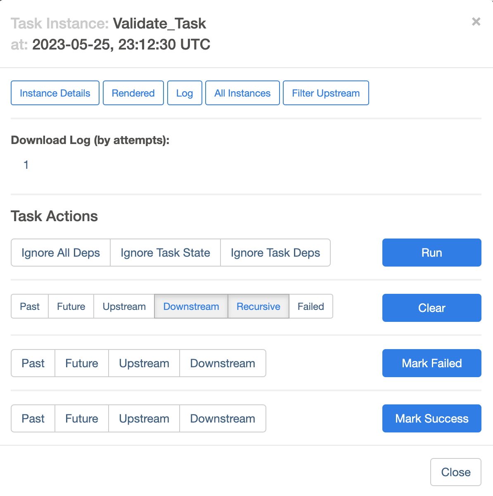

==============================
Nucleus Monitoring User Guide
==============================

.. contents:: Table of Contents
   :depth: 1
   :local:
   :backlinks: none

The workflow execution on Nucleus can be monitored using the following 2 features.

1. Airflow UI
2. CloudWatch Dashboard

-----------------
Using Airflow UI
-----------------

Airflow UI contains many useful views to monitor the execution of a workflow.

To use the Airflow, it is required to login to the Airflow UI as follows.

1. Login to AWS (NGAP) with NGAPShApplicationDeveloper role.
2. Visit Airflow UI of Nucleus (https://us-west-2.console.aws.amazon.com/mwaa/home?region=us-west-2#environments/PDS-Nucleus-Airflow-Env/sso).

After you logged into the Airflow UI, the following views can be used to monitor the execution of workflows.

* DAGs View – List of DAGs in Airflow environment
* Tree View - Visualization of DAG’s dependencies and their current status for a specific run as a tree
* Graph View - Visualization of DAG’s dependencies and their current status for a specific run as a graph
* Calendar View - An overview of your entire DAG’s history over months, or years
* Task Duration - The duration of different tasks over the past N runs
* Task Tries - Shows a line graph of the number of tries for each task in a DAG run over time
* Landing Times - Airflow landing times are calculated from the task’s scheduled time to the time the task finishes, either with success or another state
* Gantt Chart - Provides a way to analyze task durations and overlaps

More details about these views are available at: https://airflow.apache.org/docs/apache-airflow/stable/ui.html#

|

---------------------------------------------
Where in the pipeline is currently executing?
---------------------------------------------

The Graph view or Tree view can be used to check the progress of a workflow as shown in the following screenshots.

To view the Tree view and Graph view:

1. 	Click on the DAG name in the home page (DAGs view) of the Airflow UI

|

2. 	Click on the Tree tab to see the Tree View.

.. image:: ../_static/images/airflow_tree_view.png
  :alt: Airflow Tree View

|

3. 	To check the Graph View, click on the Graph tab.

.. image:: ../_static/images/airflow_graph_view.png
  :alt: Airflow Graph View

|

The status of each task is represented with following color codes.

|

------------------------------
What/if something has failed?
------------------------------

If a task is failed, then it will be marked in red color in Grid view and Tree view. The following screenshot shows an example for a failed task (Execute_Integration_Tests).

|

-----------------------------------
When has it completed successfully?
-----------------------------------

If a workflow is completed successfully, all tasks of the workflow will appear in dark green color as shown in the following screenshot.

.. image:: ../_static/images/airflow_successful_workflow_graph_view.png
  :alt: Airflow Successful Workflow in Graph View

Please note that in the following screenshot, only the second execution tree from the left is successful.

.. image:: ../_static/images/airflow_successful_workflow_tree_view.png
  :alt: Airflow Successful Workflow in Tree View

.. note::

    It is possible to write a DAG (workflow) in such a way, that the last task of the workflow can be successful, only if all the parent tasks are successful by using a trigger rule called `all_success` in the DAG python file. This is the default trigger rule.

.. code-block::

	# Print end date
	print_end_date = BashOperator(
    	    task_id='Print_End_Date',
    	    bash_command='date',
    	    trigger_rule=TriggerRule.ALL_SUCCESS
	)

In the examples shown above, the trigger rule for the last task is given as `all_done` (that means all parent tasks of the workflow are completed, regardless of their success/failed status).

.. code-block::

	# Print end date
	print_end_date = BashOperator(
    	    task_id='Print_End_Date',
    	    bash_command='date',
    	    trigger_rule=TriggerRule.ALL_DONE
	)

|

-------------------------------------------------------
How to see the failure reports from the specific tools?
-------------------------------------------------------

If there is a failed tasks there are 2 ways to check the logs coming from the task.

1. 	Using the Airflow UI
2. 	Using CloudWatch Dashboard

|

----------------------------------
Checking logs using the Airflow UI
----------------------------------

It is possible to check an overview of logs by clicking on the failed task in Grid view or Tree view as shown in the following screenshots.

To view an overview of logs for a task:

1. 	Click on the task (in this example, click on Validate_Task)

.. image:: ../_static/images/airflow_validate_failed_task.png
  :alt: Airflow Validate Failed Task

2. 	Click on the “Log” button.

3. 	This will load the overview of logs as follows.

.. image:: ../_static/images/airflow_task_instance_logs.png
  :alt: Airflow Task Instance Logs

However, if it is required to read detailed logs, the CloudWatch dashboard can be used as explained in the next section.

|

--------------------------
Using CloudWatch Dashboard
--------------------------

Most of the Nucleus components and tasks produce CloudWatch logs. These logs are stored in CloudWatch log groups. The CloudWatch dashboard is used to see these logs. Each PDS Node has a CloudWatch Dashboard specific to that Node.

To view CloudWatch Dashboard.

1. 	Visit the CloudWatch Dashboard URL specific to your PDS Node
2. 	Login with your Cognito username and password
3. 	After authentication you will be redirected to your PDS Node Dashboard

The CloudWatch Dashboard contains Widgets that show the logs coming from Nucleus workflows as shown in the following screenshots.

.. image:: ../_static/images/example_cloud_watch_dashboard.png
  :alt: CloudWatch Dashboard Example

It is possible to maximize these widgets to get a better view of logs of specific tasks as follows.

|

----------------------------------------------------
Additional Views in Airflow UI to Monitor Workflows
----------------------------------------------------

In addition to the Airflow Views explained above, following Airflow Views can be also used to monitor workflows.

Calendar View
=============
An overview of your entire DAG’s history over months, or years.

.. image:: ../_static/images/airflow_calender_view.png
  :alt: Airflow Calendar View

|

Task Duration
=============
The duration of different tasks over the past N runs.

|

Task Tries
==========
Shows a line graph of the number of tries for each task in a DAG run over time.

.. image:: ../_static/images/airflow_task_tries_view.png
  :alt: Airflow Task Tries View

|

Landing Times
=============
Airflow landing times are calculated from the task’s scheduled time to the time the task finishes, either with success or another state.

.. image:: ../_static/images/airflow_landing_times_view.png
  :alt: Airflow Landing Times View

|

Gantt Chart
===========
Provides a way to analyze task durations and overlaps.

